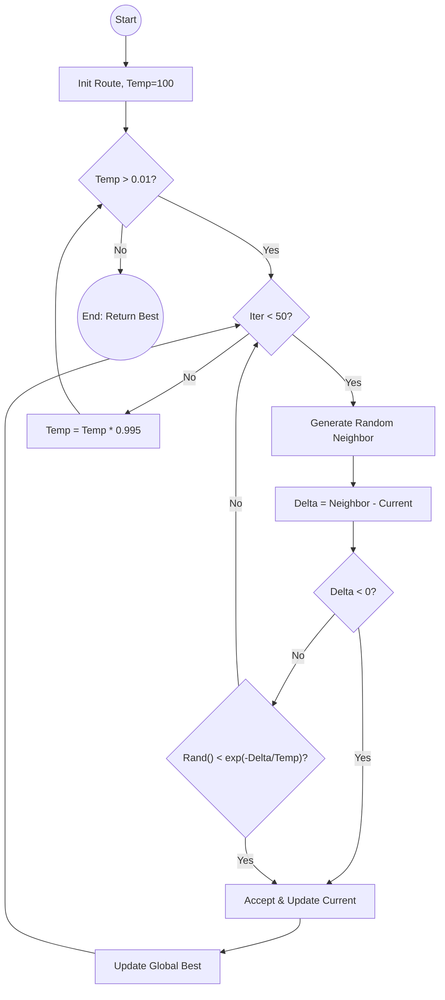
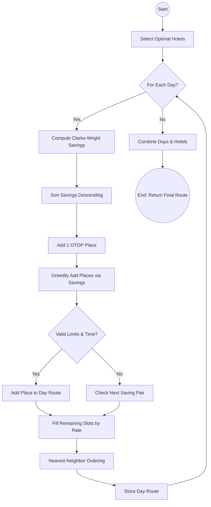
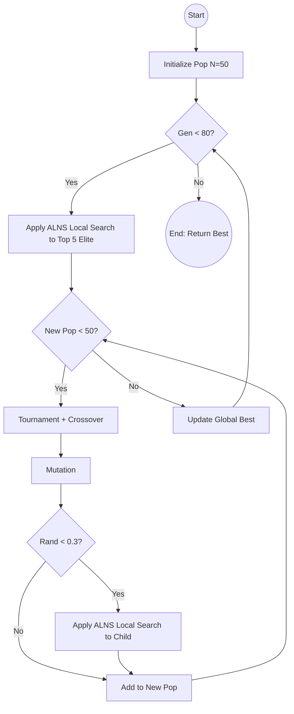
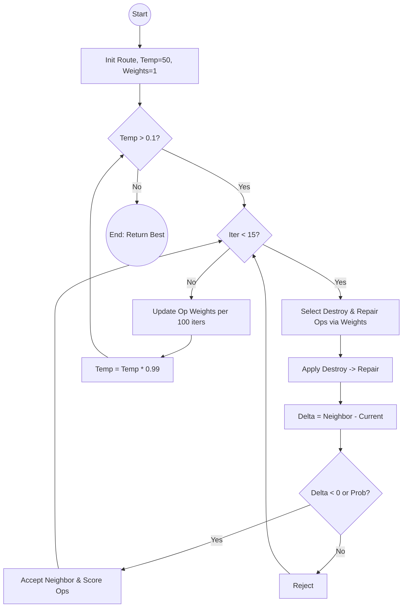
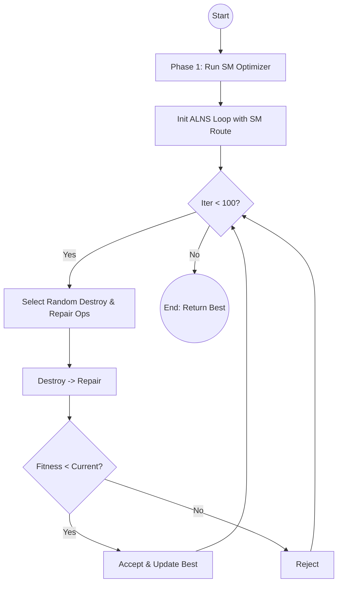
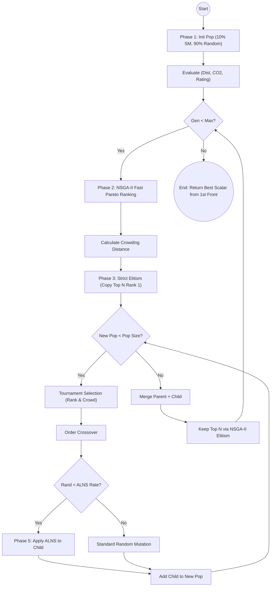

# Algorithm Workflows & Flowcharts

This document provides detailed workflows, Mermaid flowcharts, and pseudocode for all the optimization algorithms implemented in the Travel Route File-Based System (`backend/app/optimizers/`).

## 1. Genetic Algorithm (GA)

**Workflow:**
1. **Initialize:** Generate an initial population of random, valid routes.
2. **Evaluate:** Calculate fitness for all routes.
3. **Evolve:** Loop for $N$ generations:
   - **Elitism:** Carry over the top $k$ routes to the next generation without changes.
   - **Selection:** Use tournament selection to pick parents.
   - **Crossover:** Combine parts of two parents to create a child route (Order Crossover).
   - **Mutation:** Randomly swap, reverse, or replace places/hotels in the child route.
   - **Replace:** The new population replaces the old one.vOrder	ID	Name	LAT	LNG	VisitTime	RATE	CO2	TYPE
   1	D1	ท่าอากาศยานนานาชาตินครศรีฯ	8.538719	99.939889	0	4.3		Depot
   2	H1	กะโรมบ้านสวน รีสอร์ท	8.360417984	99.74073498	0	4	15.39	Hotel
   3	H2	กันตา ฮิลล์ รีสอร์ท	8.406029814	99.83979274	0	3.7	10.04	Hotel
   4	H3	คีรีวง ริเวอร์วิว	8.441130353	99.75984549	0	4.3	12.22	Hotel
   5	H4	คีรีวง วัลเล่ย์	8.410993548	99.79426705	0	4.2	15.33	Hotel
   6	H5	ชีวะโกวิว	8.348322774	99.72623718	0	4	22.65	Hotel
   7	H6	ลอยชาเลท์ รีสอร์ท	8.359188706	99.742929	0	4.9	15.77	Hotel
   8	H7	อุทยานแห่งชาติเขาหลวง	8.368783396	99.73544105	0	4.6	10.4	Hotel
   9	H8	เขาหลวง รีสอร์ท	8.359019985	99.73874393	0	4.3	7.06	Hotel
   10	H9	เคียงเขารีสอร์ท	8.442594933	99.77527623	0	4.3	15.77	Hotel
   11	H10	แพสชั่น รีสอร์ท คีรีวง	8.438770137	99.79230786	0	4.2	33.425	Hotel
   12	H11	ซิลเวอร์วัลเลย์ ฟาร์มคาเฟ่ แอนด์ รีสอร์ท	8.359247775	99.74126237	0	4.4	15.58	Hotel
   13	H12	ช่องลมวัลเลย์	8.361671492	99.78182317	0	4.6	24.198	Hotel
   14	H13	The Creek Haus	8.361078304	99.7268513	0	4.6	8.72	Hotel
   15	H14	ลานสกาฟาร์มแกะ	8.333094163	99.78670471	0	5	11.35	Hotel
   16	H15	ขุนเล เรสเตอร์รองท์	8.335065809	99.87211858	0	4.4	36.799	Hotel
   17	H16	Little House In The Valley ณ บ้านเล็กกลางหุบเขา	8.355893606	99.74985975	0	3.7	8.321	Hotel
   18	H17	กลุ่มลูกไม้บ้านคีรีวง	8.437928999	99.77938067	0	4.6	1.956	Hotel
   19	H18	คีรีวง ด้ง ฮิลล์	8.423748919	99.79432967	0	4.4	9.105	Hotel
   20	T1	เขาช้างสีลานสกา	8.28543016	99.81394367	120	4.5	0.05	Travel
   21	T2	จุดชมวิวเขาธง	8.326281691	99.70384868	60	4.4	0.087	Travel
   22	T3	น้ำตกวังไทรลานสกา	8.316418773	99.74926584	120	4.6	0	Travel
   23	T4	น้ำตกวังไม้ปัก	8.44934399	99.77588218	120	4.5	0.419	Travel
   24	T5	น้ำตกสอยดาว	8.459388585	99.7618407	120	4.7	0	Travel
   25	T6	ลานสกาฟาร์มแกะ	8.333094163	99.78670471	60	5	11.35	Travel
   26	T7	วัดโคกโพธิ์สถิตย์	8.40168917	99.80045817	60	4	6.658	Culture
   27	T8	วัดคีรีวง	8.662487535	100.4383851	60	4.4	20.337	Culture
   28	T9	วัดดินดอน	8.399666143	99.81768889	60	4.2	8.323	Culture
   29	T10	วัดลานสกาใน	8.298537504	99.78635261	60	4.7	24.918	Culture
   30	T11	ศาลเทวดานาคราช	8.3593356	99.74320649	60	5	2.513	Culture
   31	T12	ศาลาพ่อท่านคล้ายวาจาสิทธิ์ (เขาธง)	8.347978674	99.71160207	60	4.5	9.561	Culture
   32	T13	สะพานแขวนคีรีวง	8.441927255	99.76052068	60	4.5	3.287	Travel
   33	T14	สะพานข้ามคลองท่าดี	8.433305687	99.78310035	60	4.6	0.173	Travel
   34	T15	หนานหินท่าหา คีรีวง	8.440884916	99.76078468	120	4.3	0	Travel
   35	T16	อุทยานแห่งชาติเขาหลวง	8.368783396	99.73544105	120	4.6	10.404	Travel
   36	T17	วัดวังไทร	8.408340074	99.79752097	60	4.6	10.001	Culture
   37	T18	วังโบราณลานสกา	8.305565634	99.78639139	60	4.4	0.476	Culture
   38	T19	ถ้ำน้ำวังศรีธรรมโศกราช	8.333324726	99.8309911	120	4.3	0	Culture
   39	T20	วัดสรรเสริญ (สอ)	8.340119846	99.83348902	60	4.7	5.837	Culture
   40	T21	ซิลเวอร์วัลเลย์ ฟาร์มคาเฟ่ แอนด์ รีสอร์ท	8.359247775	99.74126237	90	4.4	15.578	Travel
   41	P1	กลุ่มใบไม้คีรีวง	8.434605446	99.78369948	60	4.2	1.13	OTOP
   42	P2	กลุ่มลายเทียน 	8.464901531	99.77199548	60	4.6	8.54	OTOP
   43	P3	กลุ่มมัดย้อมสีธรรมชาติ	8.43654304	99.77939442	60	4.4	4.29	OTOP
   44	P4	กลุ่มลูกไม้บ้านคีรีวง	8.437928999	99.77938067	60	4.6	1.96	OTOP
   45	R1	ร้านขนมจีนป้าเขียว	8.405618439	99.81515871	60	4.4	15.83184846	Food
   46	R2	Little House In The Valley ณ บ้านเล็กกลางหุบเขา	8.355893606	99.74985975	60	3.7	8.321	Food
   47	R3	ขุนเล เรสเตอร์รองท์	8.335065809	99.87211858	60	4.4	36.799	Food
   48	R4	ช่องลมวัลเล่ย์ ลานสกา	8.361671492	99.78182317	60	4.6	24.198	Food
   49	R5	ครัวน้องควีน	8.391332515	99.82615207	60	4.4	20.778	Food
   50	R6	The Creek Haus	8.361078304	99.7268513	60	4.6	8.72	Food
   51	R7	ซิลเวอร์วัลเลย์ ฟาร์มคาเฟ่ แอนด์ รีสอร์ท	8.359247775	99.74126237	60	4.4	15.578	Food
   52	R8	Cloudy - White	8.361079633	99.77897851	60	4.6	33.21	Food
   53	R9	The Kiriwong Valley Villas & Restaurant	8.410988241	99.79425632	60	4.2	15.33	Food
   54	R10	ครัว ฌ	8.406621737	99.84121694	60	4.6	35.087	Food
   55	R11	ครกพ่อเฒ่า	8.435410083	99.77580063	60	4.4	18.029	Food
   56	R12	Passion Resort & Mung Cruise 	8.438770137	99.79230786	60	4.4	33.425	Food
   57	R13	ครัวลุงกำนัน @คีรีวง	8.431377136	99.78424633	60	4.3	13.626	Food
   58	R14	Green Always	8.399034231	99.83951473	60	5	11.68	Food
   59	R15	คีรีวง ริเวอร์วิว	8.441130353	99.75984549	60	4.3	12.219	Food
   60	R16	ชีวะโกวิว 	8.355007095	99.72576453	60	4	22.652	Food
   61	R17	ลอยชาเลท์ รีสอร์ท	8.359431267	99.74282484	60	4.4	15.578	Food
   62	R18	เคียงเขารีสอร์ท 	8.442589619	99.77523331	60	4.3	15.767	Food
   63	R19	ลานสกาฟาร์มแกะ	8.333094163	99.78670471	60	5	11.35	Food
   
4. **Result:** Return the best route found across all generations.

**Flowchart:**
```mermaid
graph TD
    Start(("Start")) --> InitPop["Initialize Population N=100"]
    InitPop --> EvalPop["Evaluate Fitness"]
    EvalPop --> LoopGen{"Gen < 200?"}
    
    LoopGen -- Yes --> Elitism["Copy Top 5 Elite Routes"]Order	ID	Name	LAT	LNG	VisitTime	RATE	CO2	TYPE
    1	D1	ท่าอากาศยานนานาชาตินครศรีฯ	8.538719	99.939889	0	4.3		Depot
    2	H1	กะโรมบ้านสวน รีสอร์ท	8.360417984	99.74073498	0	4	15.39	Hotel
    3	H2	กันตา ฮิลล์ รีสอร์ท	8.406029814	99.83979274	0	3.7	10.04	Hotel
    4	H3	คีรีวง ริเวอร์วิว	8.441130353	99.75984549	0	4.3	12.22	Hotel
    5	H4	คีรีวง วัลเล่ย์	8.410993548	99.79426705	0	4.2	15.33	Hotel
    6	H5	ชีวะโกวิว	8.348322774	99.72623718	0	4	22.65	Hotel
    7	H6	ลอยชาเลท์ รีสอร์ท	8.359188706	99.742929	0	4.9	15.77	Hotel
    8	H7	อุทยานแห่งชาติเขาหลวง	8.368783396	99.73544105	0	4.6	10.4	Hotel
    9	H8	เขาหลวง รีสอร์ท	8.359019985	99.73874393	0	4.3	7.06	Hotel
    10	H9	เคียงเขารีสอร์ท	8.442594933	99.77527623	0	4.3	15.77	Hotel
    11	H10	แพสชั่น รีสอร์ท คีรีวง	8.438770137	99.79230786	0	4.2	33.425	Hotel
    12	H11	ซิลเวอร์วัลเลย์ ฟาร์มคาเฟ่ แอนด์ รีสอร์ท	8.359247775	99.74126237	0	4.4	15.58	Hotel
    13	H12	ช่องลมวัลเลย์	8.361671492	99.78182317	0	4.6	24.198	Hotel
    14	H13	The Creek Haus	8.361078304	99.7268513	0	4.6	8.72	Hotel
    15	H14	ลานสกาฟาร์มแกะ	8.333094163	99.78670471	0	5	11.35	Hotel
    16	H15	ขุนเล เรสเตอร์รองท์	8.335065809	99.87211858	0	4.4	36.799	Hotel
    17	H16	Little House In The Valley ณ บ้านเล็กกลางหุบเขา	8.355893606	99.74985975	0	3.7	8.321	Hotel
    18	H17	กลุ่มลูกไม้บ้านคีรีวง	8.437928999	99.77938067	0	4.6	1.956	Hotel
    19	H18	คีรีวง ด้ง ฮิลล์	8.423748919	99.79432967	0	4.4	9.105	Hotel
    20	T1	เขาช้างสีลานสกา	8.28543016	99.81394367	120	4.5	0.05	Travel
    21	T2	จุดชมวิวเขาธง	8.326281691	99.70384868	60	4.4	0.087	Travel
    22	T3	น้ำตกวังไทรลานสกา	8.316418773	99.74926584	120	4.6	0	Travel
    23	T4	น้ำตกวังไม้ปัก	8.44934399	99.77588218	120	4.5	0.419	Travel
    24	T5	น้ำตกสอยดาว	8.459388585	99.7618407	120	4.7	0	Travel
    25	T6	ลานสกาฟาร์มแกะ	8.333094163	99.78670471	60	5	11.35	Travel
    26	T7	วัดโคกโพธิ์สถิตย์	8.40168917	99.80045817	60	4	6.658	Culture
    27	T8	วัดคีรีวง	8.662487535	100.4383851	60	4.4	20.337	Culture
    28	T9	วัดดินดอน	8.399666143	99.81768889	60	4.2	8.323	Culture
    29	T10	วัดลานสกาใน	8.298537504	99.78635261	60	4.7	24.918	Culture
    30	T11	ศาลเทวดานาคราช	8.3593356	99.74320649	60	5	2.513	Culture
    31	T12	ศาลาพ่อท่านคล้ายวาจาสิทธิ์ (เขาธง)	8.347978674	99.71160207	60	4.5	9.561	Culture
    32	T13	สะพานแขวนคีรีวง	8.441927255	99.76052068	60	4.5	3.287	Travel
    33	T14	สะพานข้ามคลองท่าดี	8.433305687	99.78310035	60	4.6	0.173	Travel
    34	T15	หนานหินท่าหา คีรีวง	8.440884916	99.76078468	120	4.3	0	Travel
    35	T16	อุทยานแห่งชาติเขาหลวง	8.368783396	99.73544105	120	4.6	10.404	Travel
    36	T17	วัดวังไทร	8.408340074	99.79752097	60	4.6	10.001	Culture
    37	T18	วังโบราณลานสกา	8.305565634	99.78639139	60	4.4	0.476	Culture
    38	T19	ถ้ำน้ำวังศรีธรรมโศกราช	8.333324726	99.8309911	120	4.3	0	Culture
    39	T20	วัดสรรเสริญ (สอ)	8.340119846	99.83348902	60	4.7	5.837	Culture
    40	T21	ซิลเวอร์วัลเลย์ ฟาร์มคาเฟ่ แอนด์ รีสอร์ท	8.359247775	99.74126237	90	4.4	15.578	Travel
    41	P1	กลุ่มใบไม้คีรีวง	8.434605446	99.78369948	60	4.2	1.13	OTOP
    42	P2	กลุ่มลายเทียน 	8.464901531	99.77199548	60	4.6	8.54	OTOP
    43	P3	กลุ่มมัดย้อมสีธรรมชาติ	8.43654304	99.77939442	60	4.4	4.29	OTOP
    44	P4	กลุ่มลูกไม้บ้านคีรีวง	8.437928999	99.77938067	60	4.6	1.96	OTOP
    45	R1	ร้านขนมจีนป้าเขียว	8.405618439	99.81515871	60	4.4	15.83184846	Food
    46	R2	Little House In The Valley ณ บ้านเล็กกลางหุบเขา	8.355893606	99.74985975	60	3.7	8.321	Food
    47	R3	ขุนเล เรสเตอร์รองท์	8.335065809	99.87211858	60	4.4	36.799	Food
    48	R4	ช่องลมวัลเล่ย์ ลานสกา	8.361671492	99.78182317	60	4.6	24.198	Food
    49	R5	ครัวน้องควีน	8.391332515	99.82615207	60	4.4	20.778	Food
    50	R6	The Creek Haus	8.361078304	99.7268513	60	4.6	8.72	Food
    51	R7	ซิลเวอร์วัลเลย์ ฟาร์มคาเฟ่ แอนด์ รีสอร์ท	8.359247775	99.74126237	60	4.4	15.578	Food
    52	R8	Cloudy - White	8.361079633	99.77897851	60	4.6	33.21	Food
    53	R9	The Kiriwong Valley Villas & Restaurant	8.410988241	99.79425632	60	4.2	15.33	Food
    54	R10	ครัว ฌ	8.406621737	99.84121694	60	4.6	35.087	Food
    55	R11	ครกพ่อเฒ่า	8.435410083	99.77580063	60	4.4	18.029	Food
    56	R12	Passion Resort & Mung Cruise 	8.438770137	99.79230786	60	4.4	33.425	Food
    57	R13	ครัวลุงกำนัน @คีรีวง	8.431377136	99.78424633	60	4.3	13.626	Food
    58	R14	Green Always	8.399034231	99.83951473	60	5	11.68	Food
    59	R15	คีรีวง ริเวอร์วิว	8.441130353	99.75984549	60	4.3	12.219	Food
    60	R16	ชีวะโกวิว 	8.355007095	99.72576453	60	4	22.652	Food
    61	R17	ลอยชาเลท์ รีสอร์ท	8.359431267	99.74282484	60	4.4	15.578	Food
    62	R18	เคียงเขารีสอร์ท 	8.442589619	99.77523331	60	4.3	15.767	Food
    63	R19	ลานสกาฟาร์มแกะ	8.333094163	99.78670471	60	5	11.35	Food
    
    Elitism --> LoopPop{"New Pop < 100?"}
    
    LoopPop -- Yes --> Selection["Tournament Selection x2"]
    Selection --> Crossover["Order Crossover prob=0.8"]
    Crossover --> Mutation["Mutation prob=0.3"]
    Mutation --> EvalChild["Evaluate Child & Add to New Pop"]
    EvalChild --> LoopPop
    
    LoopPop -- No --> UpdateBest["Update Global Best Route"]
    UpdateBest --> LoopGen
    
    LoopGen -- No --> End(("End: Return Best"))
```

**Pseudocode:**
```text
function GA_Optimize():
    population = GenerateRandomPopulation(size=100)
    best_route = MinFitness(population)

    for gen from 1 to 200:
        new_population = []
        new_population.add(Top 5 Elite from population)
        
        while size(new_population) < 100:
            parent1 = TournamentSelect(population, tournament_size=5)
            parent2 = TournamentSelect(population, tournament_size=5)
            
            child = Crossover(parent1, parent2, rate=0.8)
            child = Mutate(child, rate=0.3)
            
            new_population.add(child)
            
        population = new_population
        best_route = MinFitness(population ∪ {best_route})
        
    return best_route
```

---

## 2. Simulated Annealing (SA)

**Workflow:**
1. **Initialize:** Generate a random initial route and set a starting temperature.
2. **Iterate per Temp:** For a fixed number of iterations, explore the neighborhood.
3. **Neighborhood Move:** Swap, reverse, or replace places/hotels to generate a neighbor.
4. **Acceptance:** If the neighbor is better, accept it. If worse, accept it probabilistically based on the temperature.
5. **Cooling:** Multiply the temperature by a cooling rate.
6. **Result:** Return the best route found when the minimum temperature is reached.

**Flowchart:**


**Pseudocode:**
```text
function SA_Optimize():
    current_route = GenerateRandomRoute()
    best_route = current_route
    temp = 100.0
    
    while temp > 0.01:
        for iter from 1 to 50:
            neighbor = GenerateRandomNeighbor(current_route)
            delta = Fitness(neighbor) - Fitness(current_route)
            
            if delta < 0 or Random() < exp(-delta / temp):
                current_route = neighbor
                if Fitness(current_route) < Fitness(best_route):
                    best_route = current_route
                    
        temp = temp * 0.995
        
    return best_route
```

---

## 3. Saving Method (SM - Clarke-Wright Heuristic)

**Workflow:**
1. **Select Hotels:** Greedily select the best hotel(s) based on average distance to the depot and tourist spots.
2. **Compute Savings:** For each day, compute the distance saved by combining two places rather than visiting them separately from the hub.
3. **Construct Route:** Sort the savings and greedily append pairs of places into the day's route, respecting constraints (max places, time windows, OTOP requirement).
4. **Optimize Order:** Use a nearest-neighbor approach to finalize the ordering of places within each day.

**Flowchart:**


**Pseudocode:**
```text
function SM_Optimize():
    hotel_ids = SelectBestHotels(trip_days - 1)
    route_days = []
    
    for day = 1 to trip_days:
        hub = Start location for day
        end = End location for day
        
        available_places = All candidates excluding already used
        savings = ComputeClarkeWrightSavings(hub, available_places)
        
        day_route = [Pick Best OTOP for hub, Pick Best Food for hub]
        
        for pair in savings:
            if pair fits within max_places and time_window:
                day_route.append(pair)
                
        if length(day_route) < max_places:
            day_route.append(Best rated unused places)
            
        day_route = NearestNeighborOrder(hub, end, day_route)
        route_days.append(day_route)
        
    return Route(route_days, hotel_ids)
```

---

## 4. Genetic Algorithm + ALNS (GA+ALNS)

**Workflow:**
1. **Base:** Uses the standard GA framework.
2. **Enhancement:** Integrates ALNS (Adaptive Large Neighborhood Search) as a local search mechanism.
3. **Elite Polish:** The top $k$ elite routes are passed through the ALNS optimizer for refinement every generation.
4. **Child Polish:** 30% of newly generated children are passed through the ALNS optimizer before being added to the population.

**Flowchart:**


**Pseudocode:**
```text
function GA_ALNS_Optimize():
    population = GenerateRandomPopulation(size=50)
    best_route = MinFitness(population)
    
    for gen from 1 to 80:
        new_population = []
        
        for elite in Top 5 of population:
            improved_elite = ALNS_LocalSearch(elite, iterations=10)
            new_population.add(improved_elite)
            
        while size(new_population) < 50:
            parent1, parent2 = TournamentSelect(x2)
            child = Crossover(parent1, parent2)
            child = Mutate(child)
            
            if Random() < 0.3:
                child = ALNS_LocalSearch(child, iterations=10)
                
            new_population.add(child)
            
        population = new_population
        best_route = MinFitness(population ∪ {best_route})
        
    return best_route

function ALNS_LocalSearch(route, iterations):
    best = route
    for iter from 1 to iterations:
        destroy_op = Random(Random, Worst, Shaw)
        repair_op = Random(Greedy, Random, Regret)
        
        destroyed = destroy_op(route)
        repaired = repair_op(destroyed)
        
        if Fitness(repaired) < Fitness(best):
            best = repaired
    return best
```

---

## 5. Simulated Annealing + ALNS (SA+ALNS)

**Workflow:**
1. **Base:** Follows the SA temperature and acceptance schema.
2. **Neighborhood Generation:** Instead of random moves, neighbors are generated by applying one Destroy operator and one Repair operator.
3. **Adaptive Weights:** Operators are selected based on roulette wheel selection (weights). Weights are updated based on the historical success of the operators (adaptive).

**Flowchart:**


**Pseudocode:**
```text
function SA_ALNS_Optimize():
    current = GenerateRandomRoute()
    best = current
    temp = 50.0
    destroy_weights = [1.0, 1.0, 1.0]
    repair_weights = [1.0, 1.0, 1.0]
    
    while temp > 0.1:
        for iter from 1 to 15:
            destroy_op = SelectWeighted(destroy_weights)
            repair_op = SelectWeighted(repair_weights)
            
            neighbor = repair_op(destroy_op(current))
            delta = Fitness(neighbor) - Fitness(current)
            
            accept = False
            if delta < 0:
                accept = True
                UpdateScores(destroy_op, repair_op, score=+3 or +2)
            else if Random() < exp(-delta / temp):
                accept = True
                UpdateScores(destroy_op, repair_op, score=+1)
                
            if accept:
                current = neighbor
                if Fitness(current) < Fitness(best): best = current
                
        if total_iterations % 100 == 0:
            destroy_weights, repair_weights = UpdateWeights(scores)
            
        temp = temp * 0.99
        
    return best
```

---

## 6. Saving Method + ALNS (SM+ALNS)

**Workflow:**
1. **Phase 1 (Construction):** Run the deterministic SM optimizer to rapidly build a high-quality initial solution.
2. **Phase 2 (Refinement):** Pass the SM route into an ALNS loop.
3. **ALNS Loop:** For $N$ iterations, randomly destroy and repair the route, greedily accepting any improvements.

**Flowchart:**


**Pseudocode:**
```text
function SM_ALNS_Optimize():
    current = SM_Optimize()  // Generates high-quality starting point
    best = current
    
    for iter from 1 to 100:
        destroy_op = Random(Random, Worst, Shaw)
        repair_op = Random(Greedy, Random, Regret)
        
        neighbor = repair_op(destroy_op(current))
        
        if Fitness(neighbor) < Fitness(current):
            current = neighbor
            if Fitness(current) < Fitness(best):
                best = current
                
    return best
```

---

## 7. Multi-Objective Memetic Algorithm (MOMA)

**Workflow:**
1. **Initialization:** Create an initial population where 10% are derived from the Saving Method (SM) for rapid convergence, and the rest are generated randomly.
2. **NSGA-II Backbone:** Evaluate all routes across three distinct objectives (Distance, CO2, and negative Rating). Do not collapse these into a single scalar fitness. Instead, assign a Non-Dominated Pareto Rank and a Crowding Distance to each route.
3. **Strict Elitism:** At the start of each generation, the top routes (from the 1st Pareto Front) are explicitly protected and carried over without any mutation.
4. **Reproduction & ALNS:** Generate offspring via Tournament Selection (preferring better rank and wider crowding distance) and Order Crossover. Apply ALNS (Memetic local search) exclusively to the offspring.

**Flowchart:**


**Pseudocode:**
```text
// 1. Initialization (Phase 1: Hybrid Seed)
Create empty population P
P_SM = Generate routes using SM_Optimize() (10% of Pop size)
P_Random = GenerateRandomPopulation(90% of Pop size)
P = P_SM ∪ P_Random
Evaluate multiple objectives for each route in P (F1: Dist, F2: CO2, F3: -Rating)

Generation = 1

// 2. Evolution Loop (Phase 2: NSGA-II Backbone)
WHILE Generation <= Max_Generations DO:
    
    Create new_population P_child
    
    // a. Strict Elitism
    Assign Pareto Ranks using Non-dominated Sorting on P
    Copy Top N Elites directly from P to P_child
    
    // b. Reproduction
    WHILE size(P_child) < Pop_Size DO:
        // Selection based on Pareto Rank and Crowding Distance
        Select parents P1, P2 using Binary Tournament
        Child = Order_Crossover(P1, P2)
        
        // c. Memetic Local Search (Phase 3: ALNS Injection)
        IF Random() < ALNS_Mutation_Rate THEN
            destroy_op = Select Random Destroy
            repair_op = Select Random Repair
            Child = repair_op(destroy_op(Child))
        ELSE IF Random() < Standard_Mutation_Rate THEN
            Child = Mutate_Swap_or_Reverse(Child)
        END IF
        
        Add Child to P_child
    END WHILE
    
    // d. Environmental Selection
    P_combined = P ∪ P_child
    Assign Pareto Ranks on P_combined
    Calculate Crowding Distance
    P = SelectTopN(P_combined, Pop_Size)
    
    Generation = Generation + 1
END WHILE

// 3. Return Best Solution
RETURN best_balanced_route_from(Pareto_Front(P))
```

---

## 8. ALNS Operators Reference

### Destroy Operators
- **Random Removal (`random_removal`):** Randomly selects $N$ places and removes them from the route. Promotes broad exploration.
- **Worst Removal (`worst_removal`):** Iteratively evaluates the cost reduction of removing each place, and removes the $N$ places that improve the fitness the most.
- **Shaw Removal (`shaw_removal`):** Removes places that are geographically close to each other (based on distance matrix) to reorganize entire local clusters.

### Repair Operators
- **Greedy Insert (`greedy_insert`):** Tests every removed place at every possible insertion point and iteratively inserts the place that results in the lowest immediate fitness cost.
- **Random Insert (`random_insert`):** Inserts removed places back into random valid positions across any day.
- **Regret Insert (`regret_insert`):** Evaluates the cost of inserting a place at its best position vs its second-best position (the "regret"). Inserts the place with the highest regret first, delaying easier decisions.
