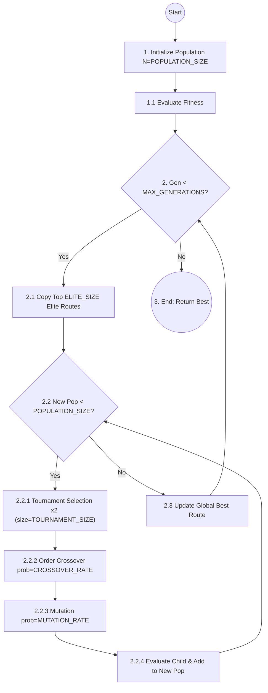
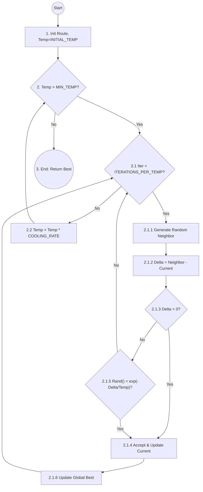
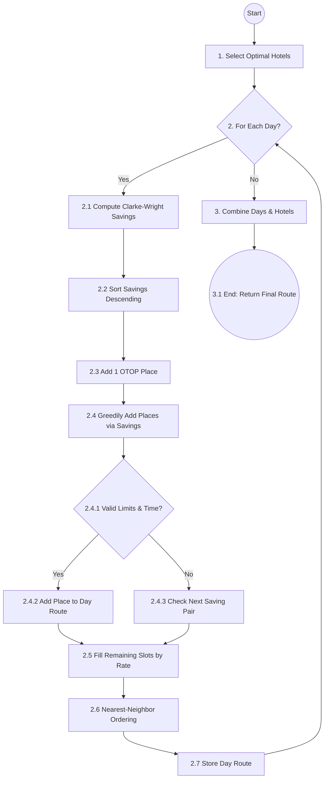
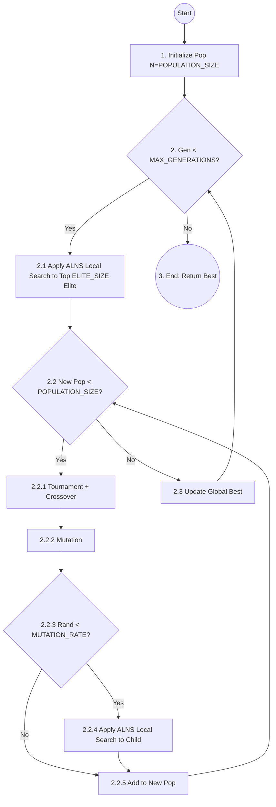
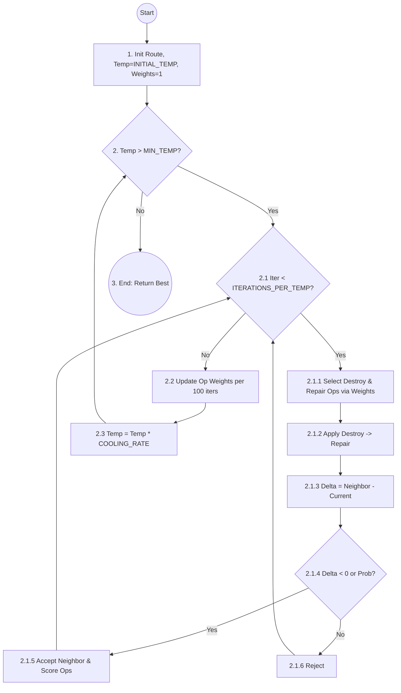
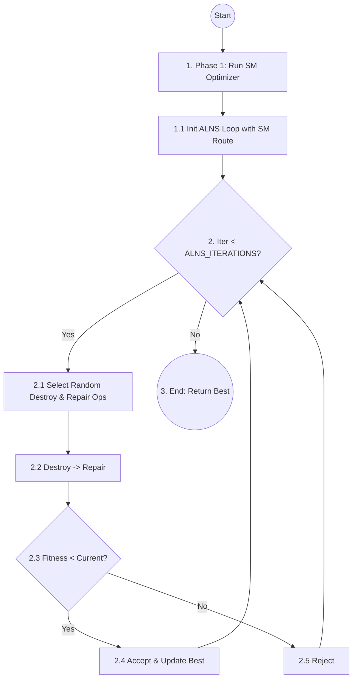
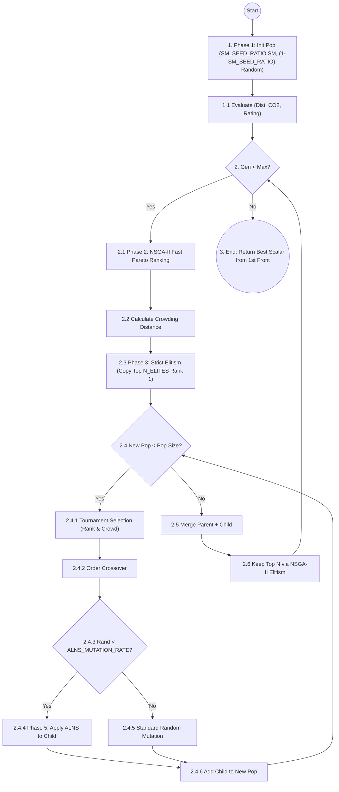
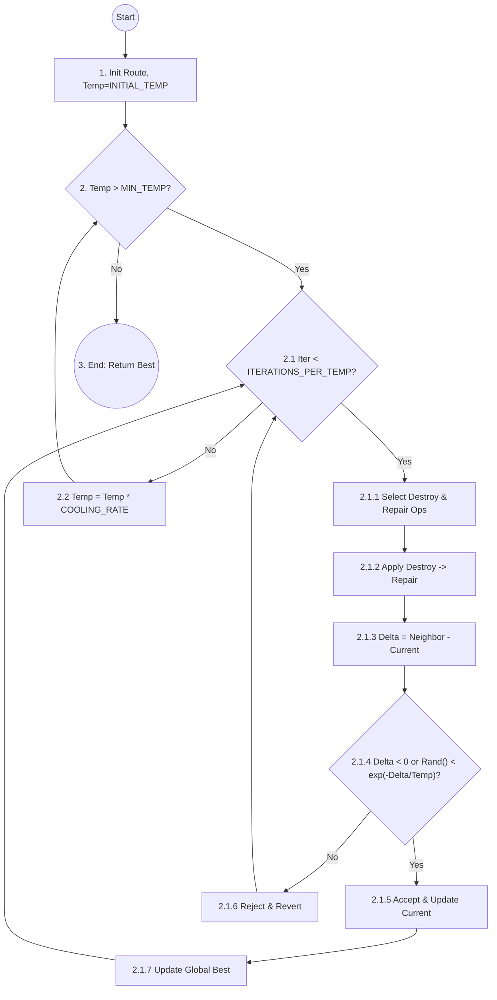

# Algorithm Workflows & Flowcharts

This document provides detailed workflows, Mermaid flowcharts, and pseudocode for all the optimization algorithms implemented in the Travel Route File-Based System (`backend/app/optimizers/`).

## 1. Genetic Algorithm (GA)

**Workflow:**
1. **Initialize:** Generate an initial population of random, valid routes.
2. **Evaluate:** Calculate fitness for all routes.
3. **Evolve:** Loop for $N$ generations:
   - **Elitism:** Carry over the top $k$ routes to the next generation without changes.
   - **Selection:** Use tournament selection to pick parents.
   - **Crossover:** Combine parts of two parents to create a child route (Order Crossover).
   - **Mutation:** Randomly swap, reverse, or replace places/hotels in the child route.
   - **Replace:** The new population replaces the old one.
4. **Result:** Return the best route found across all generations.

**Flowchart:**


**Pseudocode:**
```text
Input:
  - POPULATION_SIZE (e.g., 100)
  - MAX_GENERATIONS (e.g., 200)
  - CROSSOVER_RATE (e.g., 0.8)
  - MUTATION_RATE (e.g., 0.3)
  - TOURNAMENT_SIZE (e.g., 5)
  - ELITE_SIZE (e.g., 5)

// 1. Initialization
Create initial population P = GenerateRandomPopulation(size=POPULATION_SIZE)
Evaluate fitness for each route in P
best_route = MinFitness(P)
Generation = 1

// 2. Evolution Loop
WHILE Generation <= MAX_GENERATIONS DO:
    
    Create new_population P_new
    
    // 2.1 Elitism
    Add Top ELITE_SIZE Elite from P to P_new
    
    WHILE size(P_new) < POPULATION_SIZE DO:
        // 2.2 Selection
        Select parents P1, P2 from P based on fitness (Tournament, size=TOURNAMENT_SIZE)
        
        // 2.3 Crossover
        Apply Order Crossover to P1, P2 to create offspring child (rate=CROSSOVER_RATE)
        
        // 2.4 Mutation
        Apply mutation operator to child (rate=MUTATION_RATE)
        
        // 2.5 Evaluation & Replacement
        Evaluate fitness for child and add to P_new
    END WHILE
    
    // 2.6 Update Population & Best Solution
    Replace old population P with P_new
    Update best_route = MinFitness(P ∪ {best_route})
    
    // 2.7 Update Generation Counter
    Generation = Generation + 1
END WHILE

// 3. Return Best Solution
RETURN best_route
```

---

## 2. Simulated Annealing (SA)

**Workflow:**
1. **Initialize:** Generate a random initial route and set a starting temperature.
2. **Iterate per Temp:** For a fixed number of iterations, explore the neighborhood.
3. **Neighborhood Move:** Swap, reverse, or replace places/hotels to generate a neighbor.
4. **Acceptance:** If the neighbor is better, accept it. If worse, accept it probabilistically based on the temperature.
5. **Cooling:** Multiply the temperature by a cooling rate.
6. **Result:** Return the best route found when the minimum temperature is reached.

**Flowchart:**


**Pseudocode:**
```text
Input:
  - INITIAL_TEMP (e.g., 1000)
  - COOLING_RATE (e.g., 0.95)
  - MIN_TEMP (e.g., 1)
  - ITERATIONS_PER_TEMP (e.g., 10)

// 1. Initialization
Create initial current_route = GenerateRandomRoute()
best_route = current_route
Set initial temperature Temp = INITIAL_TEMP

// 2. Annealing Loop
WHILE Temp > MIN_TEMP DO:
    
    // 2.1 Iterations at current temperature
    FOR Iteration from 1 to ITERATIONS_PER_TEMP DO:
        
        // 2.1.1 Neighborhood Move
        Generate neighbor from current_route (randomly swap/reverse/replace)
        
        // 2.1.2 Evaluation
        Calculate delta = Fitness(neighbor) - Fitness(current_route)
        
        // 2.1.3 Acceptance Criterion
        IF delta < 0 OR Random() < exp(-delta / Temp) THEN
            current_route = neighbor
            
            // 2.1.4 Update Best Solution
            IF Fitness(current_route) < Fitness(best_route) THEN
                best_route = current_route
            END IF
        END IF
    END FOR
    
    // 2.2 Cooling Schedule
    Temp = Temp * COOLING_RATE
END WHILE

// 3. Return Best Solution
RETURN best_route
```

---

## 3. Saving Method (SM - Clarke-Wright Heuristic)

**Workflow:**
1. **Select Hotels:** Greedily select the best hotel(s) based on average distance to the depot and tourist spots.
2. **Compute Savings:** For each day, compute the distance saved by combining two places rather than visiting them separately from the hub.
3. **Construct Route:** Sort the savings and greedily append pairs of places into the day's route, respecting constraints (max places, time windows, OTOP requirement).
4. **Optimize Order:** Use a nearest-neighbor approach to finalize the ordering of places within each day.

**Flowchart:**


**Pseudocode:**
```text
Input:
  - TRIP_DAYS (e.g., 3)
  - PLACES_LIST (array of locations)
  - DISTANCE_MATRIX (NxN matrix)
  - TIME_MATRIX (NxN matrix)

// 1. Initialization
Select optimal hotel_ids based on average distance (TRIP_DAYS - 1)
Initialize empty list route_days

// 2. Day-by-Day Construction Loop
FOR day = 1 to TRIP_DAYS DO:
    Set hub = Start location for day
    Set end = End location for day
    Define available_places = All candidates excluding already used
    
    // 2.1 Savings Calculation
    Compute Clarke-Wright savings for all pairs from hub
    Sort savings in descending order
    
    // 2.2 Initial Day Route
    Initialize day_route with best OTOP place for hub
    
    // 2.3 Greedily Add Places
    FOR EACH pair IN sorted savings DO:
        IF pair fits within max_places AND time_window THEN
            Append pair to day_route
        END IF
    END FOR
    
    // 2.4 Fill Remaining Slots
    IF length(day_route) < max_places THEN
        Append best rated unused places to day_route
    END IF
    
    // 2.5 Finalize Order
    Apply Nearest-Neighbor ordering to day_route
    Append day_route to route_days
END FOR

// 3. Return Best Solution
RETURN Route(route_days, hotel_ids)
```

---

## 4. Genetic Algorithm + ALNS (GA+ALNS)

**Workflow:**
1. **Base:** Uses the standard GA framework.
2. **Enhancement:** Integrates ALNS (Adaptive Large Neighborhood Search) as a local search mechanism.
3. **Elite Polish:** The top $k$ elite routes are passed through the ALNS optimizer for refinement every generation.
4. **Child Polish:** 30% of newly generated children are passed through the ALNS optimizer before being added to the population.

**Flowchart:**


**Pseudocode:**
```text
Input:
  - POPULATION_SIZE (e.g., 100)
  - MAX_GENERATIONS (e.g., 200)
  - CROSSOVER_RATE (e.g., 0.8)
  - MUTATION_RATE (e.g., 0.3)
  - TOURNAMENT_SIZE (e.g., 5)
  - ELITE_SIZE (e.g., 5)
  - ALNS_ITERATIONS (e.g., 50)
  - N_REMOVE (e.g., 3)

// 1. Initialization
Create initial population P = GenerateRandomPopulation(size=POPULATION_SIZE)
Evaluate fitness for each route in P
best_route = MinFitness(P)
Generation = 1

// 2. Evolution Loop with ALNS Enhancement
WHILE Generation <= MAX_GENERATIONS DO:
    
    Create new_population P_new
    
    // 2.1 Elite Polish (ALNS Local Search)
    FOR EACH elite IN Top ELITE_SIZE of P DO:
        Apply ALNS Local Search (ALNS_ITERATIONS iterations) to elite
        Add improved_elite to P_new
    END FOR
    
    WHILE size(P_new) < POPULATION_SIZE DO:
        // 2.2 Selection
        Select parents P1, P2 using Tournament Selection
        
        // 2.3 Crossover & Mutation
        Apply Crossover to P1, P2 to create child
        Apply Mutation to child
        
        // 2.4 Child Polish (ALNS Local Search)
        IF Random() < MUTATION_RATE THEN
            Apply ALNS Local Search (ALNS_ITERATIONS iterations) to child
        END IF
        
        // 2.5 Evaluation & Replacement
        Evaluate fitness for child and add to P_new
    END WHILE
    
    // 2.6 Update Population & Best Solution
    Replace old population P with P_new
    Update best_route = MinFitness(P ∪ {best_route})
    
    // 2.7 Update Generation Counter
    Generation = Generation + 1
END WHILE

// 3. Return Best Solution
RETURN best_route
```

---

## 5. Simulated Annealing + ALNS (SA+ALNS)

**Workflow:**
1. **Base:** Follows the SA temperature and acceptance schema.
2. **Neighborhood Generation:** Instead of random moves, neighbors are generated by applying one Destroy operator and one Repair operator.
3. **Adaptive Weights:** Operators are selected based on roulette wheel selection (weights). Weights are updated based on the historical success of the operators (adaptive).

**Flowchart:**


**Pseudocode:**
```text
Input:
  - INITIAL_TEMP (e.g., 1000)
  - COOLING_RATE (e.g., 0.95)
  - MIN_TEMP (e.g., 1)
  - ITERATIONS_PER_TEMP (e.g., 10)
  - N_REMOVE (e.g., 3)

// 1. Initialization
Create initial current_route = GenerateRandomRoute()
best_route = current_route
Set initial temperature Temp = INITIAL_TEMP
Initialize destroy_weights and repair_weights (all 1.0)
Total_Iterations = 0

// 2. Annealing & ALNS Loop
WHILE Temp > MIN_TEMP DO:
    
    // 2.1 Iterations at current temperature
    FOR Iteration from 1 to ITERATIONS_PER_TEMP DO:
        
        // 2.1.1 Adaptive Operator Selection
        Select destroy_op based on destroy_weights
        Select repair_op based on repair_weights
        
        // 2.1.2 Neighborhood Move (Destroy & Repair)
        Apply destroy_op then repair_op to current_route to create neighbor
        
        // 2.1.3 Evaluation
        Calculate delta = Fitness(neighbor) - Fitness(current_route)
        
        // 2.1.4 Acceptance & Scoring
        Set accept = False
        IF delta < 0 THEN
            accept = True
            Increase scores for destroy_op and repair_op (+3 or +2)
        ELSE IF Random() < exp(-delta / Temp) THEN
            accept = True
            Increase scores for destroy_op and repair_op (+1)
        END IF
        
        // 2.1.5 Update Route
        IF accept is True THEN
            current_route = neighbor
            IF Fitness(current_route) < Fitness(best_route) THEN
                best_route = current_route
            END IF
        END IF
        
        Total_Iterations = Total_Iterations + 1
    END FOR
    
    // 2.2 Adaptive Weights Update
    IF Total_Iterations is multiple of 100 THEN
        Update destroy_weights and repair_weights based on scores
    END IF
    
    // 2.3 Cooling Schedule
    Temp = Temp * COOLING_RATE
END WHILE

// 3. Return Best Solution
RETURN best_route
```

---

## 6. Saving Method + ALNS (SM+ALNS)

**Workflow:**
1. **Phase 1 (Construction):** Run the deterministic SM optimizer to rapidly build a high-quality initial solution.
2. **Phase 2 (Refinement):** Pass the SM route into an ALNS loop.
3. **ALNS Loop:** For $N$ iterations, randomly destroy and repair the route, greedily accepting any improvements.

**Flowchart:**


**Pseudocode:**
```text
Input:
  - ALNS_ITERATIONS (e.g., 100)
  - N_REMOVE (e.g., 3)

// 1. Initialization (Phase 1: Construction)
Create initial current_route = Run SM_Optimize() to generate high-quality base
best_route = current_route

// 2. Refinement Loop (Phase 2: ALNS)
FOR Iteration from 1 to ALNS_ITERATIONS DO:
    
    // 2.1 Operator Selection
    Select random destroy_op (Random, Worst, Shaw)
    Select random repair_op (Greedy, Random, Regret)
    
    // 2.2 Neighborhood Move (Destroy & Repair)
    Apply destroy_op then repair_op to current_route to create neighbor
    
    // 2.3 Evaluation & Acceptance
    IF Fitness(neighbor) < Fitness(current_route) THEN
        current_route = neighbor
        
        // 2.4 Update Best Solution
        IF Fitness(current_route) < Fitness(best_route) THEN
            best_route = current_route
        END IF
    END IF
END FOR

// 3. Return Best Solution
RETURN best_route
```

---

## 7. Multi-Objective Memetic Algorithm (MOMA)

**Workflow:**
1. **Initialization:** Create an initial population where 10% are derived from the Saving Method (SM) for rapid convergence, and the rest are generated randomly.
2. **NSGA-II Backbone:** Evaluate all routes across three distinct objectives (Distance, CO2, and negative Rating). Do not collapse these into a single scalar fitness. Instead, assign a Non-Dominated Pareto Rank and a Crowding Distance to each route.
3. **Strict Elitism:** At the start of each generation, the top routes (from the 1st Pareto Front) are explicitly protected and carried over without any mutation.
4. **Reproduction & ALNS:** Generate offspring via Tournament Selection (preferring better rank and wider crowding distance) and Order Crossover. Apply ALNS (Memetic local search) exclusively to the offspring.

**Flowchart:**


**Pseudocode:**
```text
Input:
  - POPULATION_SIZE (e.g., 100)
  - MAX_GENERATIONS (e.g., 200)
  - ALNS_MUTATION_RATE (e.g., 0.2)
  - STANDARD_MUTATION_RATE (e.g., 0.1)
  - N_ELITES (e.g., 5)
  - SM_SEED_RATIO (e.g., 0.2)

// 1. Initialization (Phase 1: Hybrid Seed)
Create empty population P
P_SM = Generate routes using SM_Optimize() (SM_SEED_RATIO of Pop size)
P_Random = GenerateRandomPopulation((1-SM_SEED_RATIO) of Pop size)
P = P_SM ∪ P_Random
Evaluate multiple objectives for each route in P (F1: Dist, F2: CO2, F3: -Rating)

Generation = 1

// 2. Evolution Loop (Phase 2: NSGA-II Backbone)
WHILE Generation <= MAX_GENERATIONS DO:
    
    Create new_population P_child
    
    // 2.1 Strict Elitism
    Assign Pareto Ranks using Non-dominated Sorting on P
    Copy Top N Elites directly from P to P_child
    
    // 2.2 Reproduction
    WHILE size(P_child) < Pop_Size DO:
        // 2.2.1 Selection based on Pareto Rank and Crowding Distance
        Select parents P1, P2 using Binary Tournament
        Child = Order_Crossover(P1, P2)
        
        // 2.2.2 Memetic Local Search (Phase 3: ALNS Injection)
        IF Random() < ALNS_MUTATION_RATE THEN
            destroy_op = Select Random Destroy
            repair_op = Select Random Repair
            Child = repair_op(destroy_op(Child))
        ELSE IF Random() < STANDARD_MUTATION_RATE THEN
            Child = Mutate_Swap_or_Reverse(Child)
        END IF
        
        Add Child to P_child
    END WHILE
    
    // 2.3 Environmental Selection
    P_combined = P ∪ P_child
    Assign Pareto Ranks on P_combined
    Calculate Crowding Distance
    P = SelectTopN(P_combined, Pop_Size)
    
    Generation = Generation + 1
END WHILE

// 3. Return Best Solution
RETURN best_balanced_route_from(Pareto_Front(P))
```

---

## 8. Adaptive Large Neighborhood Search (ALNS)

**Workflow:**
1. **Initialize:** Receive an initial route and set a starting temperature.
2. **Iterate per Temp:** Loop while the current temperature is above the minimum temperature.
3. **Inner Iterations:** For a fixed number of iterations at the current temperature:
   - **Select Operators:** Randomly select one Destroy operator and one Repair operator.
   - **Neighborhood Move:** Apply the Destroy operator to remove $N$ places, then apply the Repair operator to reinsert them.
   - **Evaluation:** Calculate the fitness change (Delta).
   - **Acceptance:** If the new route is better, accept it. If worse, accept it probabilistically based on the SA criterion.
4. **Cooling:** Multiply the temperature by a cooling rate.
5. **Result:** Return the best route found when the minimum temperature is reached.

**Flowchart:**


**Pseudocode:**
```text
Input:
  - INITIAL_TEMP (e.g., 100.0)
  - MIN_TEMP (e.g., 0.01)
  - COOLING_RATE (e.g., 0.995)
  - ITERATIONS_PER_TEMP (e.g., 50)
  - N_REMOVE (e.g., 2)

// 1. Initialization
current_route = GetInitialRoute()
best_route = current_route
Set initial temperature Temp = INITIAL_TEMP

// 2. Annealing & ALNS Loop
WHILE Temp > MIN_TEMP DO:
    
    // 2.1 Inner Iterations
    FOR Iteration from 1 to ITERATIONS_PER_TEMP DO:
        
        // 2.1.1 Operator Selection
        Select random destroy_op
        Select random repair_op
        
        // 2.1.2 Neighborhood Move (Destroy & Repair)
        neighbor = repair_op(destroy_op(current_route, N_REMOVE))
        
        // 2.1.3 Evaluation
        Calculate delta = Fitness(neighbor) - Fitness(current_route)
        
        // 2.1.4 Acceptance Criterion (SA)
        IF delta < 0 OR Random() < exp(-delta / Temp) THEN
            current_route = neighbor
            
            // 2.1.5 Update Best Solution
            IF Fitness(current_route) < Fitness(best_route) THEN
                best_route = current_route
            END IF
        END IF
    END FOR
    
    // 2.2 Cooling Schedule
    Temp = Temp * COOLING_RATE
END WHILE

// 3. Return Best Solution
RETURN best_route
```

---

## 9. ALNS Operators Reference

### Destroy Operators
- **Random Removal (`random_removal`):** Randomly selects $N$ places and removes them from the route. Promotes broad exploration.
- **Worst Removal (`worst_removal`):** Iteratively evaluates the cost reduction of removing each place, and removes the $N$ places that improve the fitness the most.
- **Shaw Removal (`shaw_removal`):** Removes places that are geographically close to each other (based on distance matrix) to reorganize entire local clusters.

### Repair Operators
- **Greedy Insert (`greedy_insert`):** Tests every removed place at every possible insertion point and iteratively inserts the place that results in the lowest immediate fitness cost.
- **Random Insert (`random_insert`):** Inserts removed places back into random valid positions across any day.
- **Regret Insert (`regret_insert`):** Evaluates the cost of inserting a place at its best position vs its second-best position (the "regret"). Inserts the place with the highest regret first, delaying easier decisions.