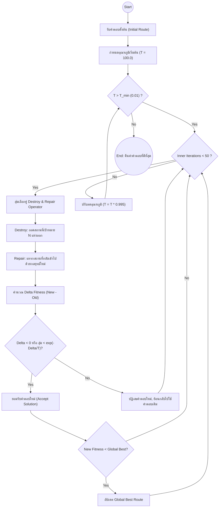

# 1.3.2 การค้นหาบริเวณใกล้เคียงขนาดใหญ่อย่างปรับตัว (Adaptive Large Neighborhood Search: ALNS)

## 1. แนวคิดและหลักการพื้นฐาน
Adaptive Large Neighborhood Search (ALNS) เป็นอัลกอริทึมเมตาฮิวริสติก (Metaheuristic) ประเภทค้นหาแบบท้องถิ่น (Local Search) ที่มีประสิทธิภาพสูงมากในการแก้ปัญหาการจัดเส้นทางยานพาหนะ (Vehicle Routing Problem: VRP) โดยมีแนวคิดหลักคือ "การทำลายแล้วสร้างใหม่" (Ruin and Recreate) แตกต่างจากการค้นหาแบบท้องถิ่นทั่วไปที่มักจะสลับตำแหน่งสถานที่เพียง 1-2 จุด (Small Neighborhood) ALNS จะทำการถอดสถานที่จำนวนมาก (เช่น 10-30% ของเส้นทาง) ออกจากคำตอบปัจจุบัน แล้วใช้กระบวนการทางฮิวริสติกที่ชาญฉลาดในการแทรกสถานที่เหล่านั้นกลับเข้าไปใหม่ เพื่อหลุดออกจากคำตอบที่ดีที่สุดระดับท้องถิ่น (Local Optima) และค้นพบโครงสร้างเส้นทางใหม่ที่สมบูรณ์แบบกว่าเดิม

## 2. สถาปัตยกรรมการทำงานของ ALNS
ALNS ไม่ได้ทำงานด้วยตัวดำเนินการทำลายและซ่อมแซมเพียงคู่เดียว แต่มีคลังของตัวดำเนินการ (Pool of Operators) หลายรูปแบบ ในแต่ละรอบการทำงาน (Iteration) อัลกอริทึมจะสุ่มเลือกตัวดำเนินการทำลาย 1 ตัว และตัวดำเนินการซ่อมแซม 1 ตัว มาทำงานร่วมกัน 

### 2.1 เกณฑ์การยอมรับคำตอบ (Acceptance Criterion)
เมื่อสร้างคำตอบใหม่ ($S'$) ขึ้นมาได้แล้ว ALNS จะต้องตัดสินใจว่าจะยอมรับคำตอบนี้ให้เป็นคำตอบปัจจุบัน ($S$) สำหรับการค้นหาในรอบต่อไปหรือไม่ ในงานวิจัยนี้ประยุกต์ใช้กฎการยอมรับแบบ **Simulated Annealing (SA)** กล่าวคือ:
* หากค่าความเหมาะสมของคำตอบใหม่ดีกว่าคำตอบเดิม ($Fitness(S') < Fitness(S)$) จะยอมรับคำตอบใหม่ทันที
* หากคำตอบใหม่แย่ลง จะยังคงมีโอกาสยอมรับได้ด้วยความน่าจะเป็น $P = e^{-\frac{Fitness(S') - Fitness(S)}{Temperature}}$ 
* ค่าอุณหภูมิ (Temperature) จะเริ่มต้นที่ระดับสูง (ยอมรับคำตอบที่แย่ได้ง่าย) และค่อยๆ เย็นตัวลงตามสมการ $T = T \times \text{Cooling Rate}$ (เช่น 0.995) ในแต่ละรอบ

## 3. ตัวดำเนินการทำลาย (Destroy Operators)
หน้าที่ของตัวดำเนินการทำลาย คือการถอดสถานที่เป้าหมายจำนวน $N$ แห่ง (ตัวอย่างเช่น $N=2$) ออกจากแผนการเดินทาง ประกอบด้วยกลยุทธ์ 3 รูปแบบ:

### 3.1 Random Removal (การถอดแบบสุ่ม)
สุ่มเลือกสถานที่ $N$ แห่งออกจากเส้นทางโดยไม่มีเงื่อนไข วิธีนี้เป็นพื้นฐานที่สุดเพื่อเพิ่มความหลากหลาย (Diversification) และบังคับให้อัลกอริทึมสำรวจพื้นที่คำตอบใหม่ๆ ที่คาดไม่ถึง ป้องกันไม่ให้การค้นหากระจุกตัวอยู่แต่ในรูปแบบเดิม

### 3.2 Worst Removal (การถอดจุดที่แย่ที่สุด)
เป็นการทำลายแบบมุ่งเน้น (Intensification) โดยอัลกอริทึมจะประเมิน "ค่าความเสียเปรียบ" ของสถานที่แต่ละแห่งในเส้นทาง โดยการจำลองถอดสถานที่นั้นออก แล้วดูว่าค่า Fitness ของเส้นทางดีขึ้น (ลดลง) เท่าไหร่ 
สถานที่ที่เมื่อถอดออกแล้วทำให้ระยะทางรวมลดฮวบ หรือทำให้ปริมาณ CO2 ลดลงอย่างมีนัยสำคัญ จะถูกมองว่าเป็น "ตัวถ่วง (Worst Nodes)" และจะถูกเลือกให้ถูกถอดออกอย่างจงใจ

### 3.3 Shaw Removal / Relatedness Removal (การถอดแบบกลุ่มสัมพันธ์)
ถอดกลุ่มสถานที่ที่มี "ความเกี่ยวข้องกันสูง" ออกไปพร้อมๆ กัน ในบริบทของการท่องเที่ยว ความเกี่ยวข้องกันมักพิจารณาจาก "ระยะทาง" หากสถานที่ A และ B อยู่ใกล้กันมาก การถอดทั้งคู่ออกไปพร้อมกันจะทำให้เปิดพื้นที่ว่างในโซนภูมิศาสตร์นั้น ช่วยให้อัลกอริทึมสามารถจัดระเบียบโครงสร้างการเดินทางในโซนนั้นใหม่ทั้งหมดได้อย่างมีประสิทธิภาพ มากกว่าการถอดเพียงจุดใดจุดหนึ่ง

## 4. ตัวดำเนินการซ่อมแซม (Repair Operators)
หลังจากมีสถานที่ถูกถอดออก (Removed Nodes) ตัวดำเนินการซ่อมแซมจะรับหน้าที่แทรกสถานที่เหล่านั้นกลับเข้าไปในแผนการเดินทาง ประกอบด้วย:

### 4.1 Greedy Insert (การแทรกแบบตรรกะเชิงละโมบ)
สำหรับสถานที่แต่ละแห่งที่ถูกถอดออก อัลกอริทึมจะจำลองการแทรกเข้าไปใน **"ทุกตำแหน่งที่เป็นไปได้"** ของทุกวันในแผนการเดินทาง จากนั้นคำนวณการเปลี่ยนแปลงของค่า Fitness จากนั้นจะเลือกแทรกในตำแหน่งที่ทำให้ต้นทุนโดยรวมเพิ่มขึ้นน้อยที่สุด วิธีนี้ช่วยหาตำแหน่งที่ดีที่สุดในระยะสั้น แต่มีข้อเสียคืออาจละเลยผลกระทบต่อสถานที่ตัวอื่นๆ ที่รอการแทรกอยู่

### 4.2 Regret-2 Insert (การแทรกแบบพิจารณาความเสียดาย)
เพื่อแก้ข้อบกพร่องของ Greedy Insert วิธี Regret จะคำนวณค่า "ความเสียดาย" (Regret Value) สำหรับสถานที่แต่ละแห่งที่รอการแทรก 
* `ค่าความเสียดาย = (ค่าใช้จ่ายเมื่อแทรกในตำแหน่งที่ดีที่สุดอันดับ 2) - (ค่าใช้จ่ายเมื่อแทรกในตำแหน่งที่ดีที่สุดอันดับ 1)`
* สถานที่ใดที่มีค่าความเสียดายสูงที่สุด จะถูกเลือกให้แทรกก่อน เพราะหากปล่อยไว้แล้วโดนแย่งตำแหน่งที่ดีที่สุดอันดับ 1 ไป สถานที่นั้นจะไปทำให้เส้นทางพังทลายในอนาคต เป็นการใช้กลยุทธ์แบบมองการณ์ไกล (Look-ahead)

### 4.3 Random Insert (การแทรกแบบสุ่ม)
สุ่มเลือกตำแหน่งในวันใดวันหนึ่งเพื่อแทรกสถานที่กลับเข้าไป การแทรกแบบสุ่มช่วยเพิ่มโอกาสให้โมเดลหลุดพ้นจากกรอบตรรกะแบบแผนเดิมๆ

## 5. การจัดการเงื่อนไขบังคับเชิงลึก (Constraint Handling in ALNS)
ความท้าทายขั้นสุดยอดของ ALNS ในระบบนี้คือ **"การบังคับช่วงเวลาอาหารกลางวัน (11:00-13:00 น.)"** และการมี **"OTOP อย่างน้อย 1 แห่ง"** 
ในขั้นตอนการซ่อมแซม (Repair):
* หากสถานที่ที่ถูกถอดออกเป็นประเภทร้านอาหาร (Food) ตัวดำเนินการซ่อมแซมจะต้องถูกบังคับให้พิจารณาเฉพาะตำแหน่งแทรกที่ทำให้สถานที่นั้นกลับเข้าไปอยู่ในวันเดิม (หรือวันที่ขาดแคลนร้านอาหาร)
* การประเมินตำแหน่งที่ดีที่สุดในการแทรก (Greedy/Regret) จะได้รับผลกระทบโดยตรงจาก Sliding Penalty ของเวลา หากแทรกสถานที่ Food ลงในตำแหน่งที่ทำให้เวลาเดินทางไปถึงตกอยู่ที่ 15:00 น. ค่า Fitness จะพุ่งสูงขึ้นอย่างรุนแรง ส่งผลให้อัลกอริทึมเรียนรู้ที่จะปฏิเสธตำแหน่งนั้น และพยายามขยับร้านอาหารไปไว้ตรงกลางของแผนการเดินทาง (ช่วงเที่ยง) เสมอ

## 6. ผังงานแสดงการทำงานของ ALNS (Flowchart)

