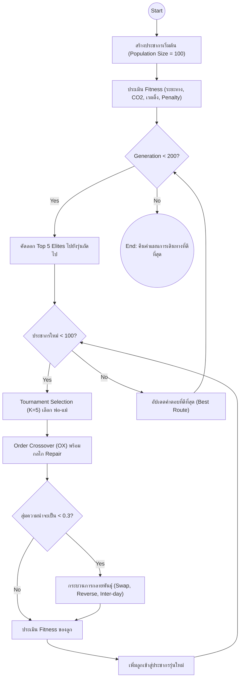

# 1.3.1 ขั้นตอนวิธีเชิงพันธุกรรม (Genetic Algorithm: GA)

## 1. แนวคิดและหลักการพื้นฐาน
ขั้นตอนวิธีเชิงพันธุกรรม (Genetic Algorithm: GA) เป็นอัลกอริทึมการค้นหาแบบสุ่ม (Stochastic Search Algorithm) ที่จัดอยู่ในกลุ่มอัลกอริทึมเชิงวิวัฒนาการ (Evolutionary Algorithms) ซึ่งได้รับแรงบันดาลใจมาจากทฤษฎีวิวัฒนาการทางธรรมชาติของชาร์ลส์ ดาร์วิน (Charles Darwin) โดยมีหลักการสำคัญคือ "การอยู่รอดของผู้ที่เหมาะสมที่สุด" (Survival of the Fittest) ในงานวิจัยนี้ GA ถูกนำมาประยุกต์ใช้เพื่อแก้ปัญหาการจัดเส้นทางยานพาหนะแบบมีกรอบเวลาและหลายวัตถุประสงค์ (Multi-Objective Vehicle Routing Problem with Time Windows: MO-VRPTW) 

กระบวนการหลักของ GA ประกอบด้วยการสร้างประชากร (Population) ของคำตอบที่เป็นไปได้ จากนั้นใช้ตัวดำเนินการทางพันธุกรรม (Genetic Operators) ได้แก่ การคัดเลือก (Selection) การไขว้เปลี่ยน (Crossover) และการกลายพันธุ์ (Mutation) เพื่อสร้างประชากรรุ่นใหม่ที่มีความเหมาะสม (Fitness) มากขึ้นเรื่อยๆ ตามจำนวนรุ่น (Generations) ที่กำหนด

## 2. การแทนรหัสโครงสร้างโครโมโซม (Chromosome Representation)
ในการแก้ปัญหาการจัดเส้นทางการท่องเที่ยวหลายวัน (Multi-day Tour) การออกแบบโครงสร้างของโครโมโซมมีความสำคัญอย่างยิ่ง โครโมโซมในระบบนี้ไม่ได้เป็นเพียงแถวลำดับเดียว (1D Array) แต่ถูกออกแบบให้เป็นโครงสร้างแบบอาร์เรย์สองมิติ (2D Array) หรือ List ของ List เพื่อรองรับการจัดกลุ่มตามวันเดินทาง และมีตัวแปรย่อยสำหรับการเลือกที่พัก (Hotel) ระหว่างวัน

**โครงสร้างโครโมโซมตัวอย่าง (ทริป 2 วัน 1 คืน):**
```text
Chromosome = {
    Day 1: [D1, T10, P1, R5, T2, H1]    // เริ่มต้นที่สนามบิน (D1) -> เที่ยว -> แวะ OTOP (P1) -> ทานอาหาร (R5) -> เข้าพักโรงแรม (H1)
    Day 2: [H1, T14, T11, P3, R2, D1]   // เริ่มจากโรงแรม (H1) -> เที่ยว -> แวะ OTOP (P3) -> ทานอาหาร (R2) -> กลับสนามบิน (D1)
    Hotel: [H1]                         // รหัสที่พักที่ใช้เชื่อมโยงระหว่างวัน
}
```

## 3. การสร้างประชากรเริ่มต้น (Initialization)
เพื่อให้กระบวนการค้นหาเป็นไปอย่างมีประสิทธิภาพและไม่เสียเวลาไปกับคำตอบที่เป็นไปไม่ได้ (Infeasible Solutions) การสร้างประชากรเริ่มต้นจำนวน 100 รูปแบบ (Population Size = 100) จะต้องสอดคล้องกับข้อจำกัดขั้นพื้นฐานดังต่อไปนี้:
1. **ขนาดของสถานที่:** ในแต่ละวันจะมีการสุ่มจำนวนสถานที่ให้ตกอยู่ในช่วง `min_places_per_day` ถึง `max_places_per_day` (เช่น 3 ถึง 7 แห่ง)
2. **การบังคับประเภทสถานที่:** แต่ละวันจะถูกบังคับให้สุ่มเลือกสถานที่ประเภทผลิตภัณฑ์ชุมชน (OTOP) จำนวน 1 แห่ง และร้านอาหาร (Food) จำนวน 1 แห่ง บรรจุลงไปในลิสต์ของวันนั้นๆ อย่างแน่นอน
3. **การเติมเต็มด้วยสถานที่ท่องเที่ยว:** พื้นที่ว่างที่เหลือจะถูกเติมเต็มด้วยสถานที่ท่องเที่ยวทั่วไป (Travel, Culture) โดยใช้กลไกวงล้อรูเล็ต (Roulette Wheel Selection) ที่ให้น้ำหนักกับสถานที่ที่มีค่าความนิยม (Rating) สูง ให้มีโอกาสถูกสุ่มเลือกมาอยู่ในแผนการเดินทางมากกว่าสถานที่ที่มีเรตติ้งต่ำ
4. **การจัดเรียงลำดับเบื้องต้น:** สถานที่ภายในแต่ละวันจะถูกสลับตำแหน่งแบบสุ่ม (Shuffle)

## 4. การประเมินความเหมาะสม (Fitness Evaluation)
ประชากรแต่ละตัวจะถูกนำมาคำนวณหาค่าความเหมาะสม (Fitness Score) ซึ่งรวมวัตถุประสงค์ 3 ด้านและค่าปรับ (Penalties) ไว้ด้วยกัน โดยฟังก์ชันความเหมาะสม $Z$ สามารถเขียนได้ดังนี้:

$$ Z = W_d \left(\frac{F_{dist}}{200}\right) + W_{co2} \left(\frac{F_{co2}}{150}\right) + W_r \left(\frac{5.0 - F_{rating}}{5.0}\right) + \mathcal{P} $$

โดยที่:
* $F_{dist}$ คือ ระยะทางรวมทั้งหมด (กิโลเมตร)
* $F_{co2}$ คือ ปริมาณก๊าซคาร์บอนไดออกไซด์รวม (กิโลกรัม)
* $F_{rating}$ คือ ค่าเฉลี่ยความนิยมของสถานที่ทั้งหมดในเส้นทาง
* $W_d, W_{co2}, W_r$ คือ ค่าน้ำหนักที่ผู้ใช้กำหนด (รวมกันเท่ากับ 1.0)
* $\mathcal{P}$ คือ ผลรวมของค่าปรับทั้งหมด (Penalty Cost)

**โครงสร้างของค่าปรับ (Penalties):**
ระบบจะลงโทษแผนการเดินทางที่ละเมิดข้อจำกัดอย่างรุนแรง เพื่อคัดทิ้งออกจากกลุ่มประชากร:
* **เกินเวลา 17:00 น.:** ปรับ +100.0 ต่อวัน
* **สถานที่ขาดหรือเกินเกณฑ์:** ปรับ +50.0 ต่อจำนวนสถานที่ที่ผิดปกติ
* **ไม่มี OTOP หรือ ร้านอาหาร:** ปรับ +50.0
* **เวลาร้านอาหาร (Lunch Window):** หากไปถึงร้านอาหารก่อน 11:00 น. หรือหลัง 13:00 น. จะถูกปรับตามสัดส่วนเวลาที่คลาดเคลื่อน (Sliding Penalty) เช่น +2.0 ทุกๆ 10 นาทีที่ผิดเพี้ยนไป

## 5. การดำเนินการทางพันธุกรรม (Genetic Operators)

### 5.1 การคัดเลือก (Tournament Selection)
ใช้วิธี Binary/K-Way Tournament โดยสุ่มโครโมโซมขึ้นมา $K$ ตัว (ในที่นี้ $K=5$) แล้วนำมาประชันกัน ตัวที่มีค่า Fitness ต่ำที่สุด (ยิ่งต่ำยิ่งดี) จะชนะและถูกเลือกไปเป็นพ่อหรือแม่ (Parent) เพื่อสร้างลูกในรุ่นถัดไป วิธีนี้ช่วยรักษาความหลากหลายทางพันธุกรรมและลดโอกาสที่ประชากรจะถูกครอบงำโดยโครโมโซมที่ดีที่สุดเพียงตัวเดียวเร็วเกินไป (Premature Convergence)

### 5.2 การไขว้เปลี่ยน (Crossover)
ใช้วิธี **Order Crossover (OX)** ซึ่งออกแบบมาสำหรับปัญหาที่ลำดับมีผล (Permutation-based) 
1. สุ่มจุดตัดสองจุดบนโครโมโซมของพ่อ (Parent 1)
2. คัดลอกยีน (สถานที่) ที่อยู่ระหว่างจุดตัดจากพ่อไปยังลูก (Child) ที่ตำแหน่งเดียวกัน
3. นำยีนที่เหลือจากแม่ (Parent 2) มาเรียงต่อในช่องว่างของลูก โดยข้ามยีนที่มีอยู่แล้วในลูก
4. **กลไกการซ่อมแซม (Repair Mechanism):** หากลูกที่เกิดมามี OTOP หรือ ร้านอาหาร หายไป หรือมีซ้ำเกิน 1 แห่ง อัลกอริทึมจะทำการซ่อมแซมโดยดึงตัวที่เกินออก และสุ่มสถานที่ประเภทที่ขาดหายไปจากฐานข้อมูลที่ยังไม่ได้ถูกเยี่ยมชม เข้ามาแทรกแทนที่ เพื่อรับประกันว่าเด็กที่เกิดใหม่จะสอดคล้องกับข้อจำกัด

### 5.3 การกลายพันธุ์ (Mutation)
มีโอกาส 30% ที่เด็กแต่ละคนจะเกิดการกลายพันธุ์ โดยระบบจะสุ่มเลือกรูปแบบใดรูปแบบหนึ่งดังต่อไปนี้:
* **Swap Mutation:** สุ่มสลับตำแหน่งของสถานที่ 2 แห่งภายในวันเดียวกัน
* **Reverse Mutation:** สุ่มเลือกช่วงย่อยในวันหนึ่ง แล้วสลับลำดับจากหลังมาหน้า (ใช้แก้ปัญหาเส้นทางที่วิ่งไขว้กันหรือเกิด Crossings)
* **Inter-day Swap:** สุ่มย้ายสถานที่ข้ามวันระหว่าง Day 1 และ Day 2 (หากสถานที่ที่ย้ายเป็น Food ต้องนำ Food จากอีกวันมาสลับแทน เพื่อรักษาสมดุล)
* **Hotel Mutation:** สุ่มเปลี่ยนโรงแรมที่พักเป็นแห่งใหม่

### 5.4 การเก็บรักษาสายพันธุ์ชั้นเลิศ (Strict Elitism)
เพื่อรับประกันว่าทางออกที่ดีที่สุดที่ค้นพบจะไม่เสื่อมถอยลง ระบบจะใช้กฎ Strict Elitism โดยทำการคัดลอกโครโมโซมที่เก่งที่สุดระดับท็อป (Top $N$, เช่น 5 ตัวแรก) ของรุ่นปัจจุบัน ข้ามไปยังรุ่นถัดไปโดยอัตโนมัติ โดยไม่ผ่านการไขว้เปลี่ยนหรือกลายพันธุ์ใดๆ ทั้งสิ้น

## 6. ผังงานแสดงการทำงานของ GA (Flowchart)

