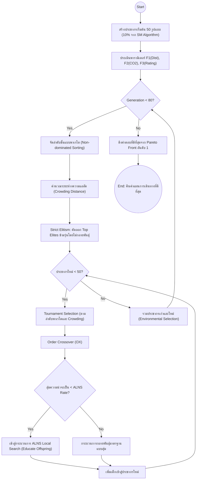

# 1.3.3 อัลกอริทึมลูกผสมเชิงมีมีติก (Hybrid GA-ALNS / MOMA)

## 1. แนวคิดและเหตุผลของการผสานวิธี (Why Hybridization?)
ในการแก้ปัญหาที่มีความซับซ้อนและมีเป้าหมายหลายมิติ (Multi-Objective) เช่นเดียวกับการจัดเส้นทางท่องเที่ยวที่ต้องคำนึงถึง ระยะทาง ปริมาณคาร์บอน (CO2) และความนิยม (Rating) ไปพร้อมๆ กับเงื่อนไขด้านเวลา อัลกอริทึมแบบเดี่ยว (Single Algorithm) มักจะพบกับข้อจำกัดที่หลีกเลี่ยงได้ยาก:
* **Genetic Algorithm (GA)** มีความสามารถในการค้นหาพื้นที่คำตอบในวงกว้าง (Global Search Space) ได้ดีมาก แต่ขาดความประณีตในการปรับแต่งคำตอบในระดับท้องถิ่น (Local Fine-tuning) ทำให้มักจะมีปัญหาเรื่องการจัดสรรเวลาอาหารกลางวันให้แม่นยำ
* **Adaptive Large Neighborhood Search (ALNS)** มีความสามารถทะลุทะลวงและจัดระเบียบเส้นทางระดับท้องถิ่น (Local Exploitation) ได้อย่างหมดจด แต่หากเริ่มต้นจากจุดที่แย่ การค้นหาอาจจะติดหล่ม (Local Optima) และหาทางออกระดับมหภาคไม่เจอ

เพื่อแก้ไขช่องโหว่ดังกล่าว ผู้วิจัยจึงได้พัฒนากลไก **อัลกอริทึมลูกผสม (Hybrid GA-ALNS)** ซึ่งมีลักษณะการทำงานแบบ **มีมีติกอัลกอริทึม (Memetic Algorithm)** หรืออธิบายให้เห็นภาพคือ การนำหลักการวิวัฒนาการตามธรรมชาติของ GA มาผสานเข้ากับ "การเรียนรู้และการฝึกฝน" แบบปัจเจกบุคคลของ ALNS

## 2. สถาปัตยกรรมระดับมหภาค: NSGA-II Backbone
แทนที่จะใช้วิธีการรวมเป้าหมายทั้งหมดให้เป็นค่าสเกลาร์ (Scalar Fitness) เพียงค่าเดียว อัลกอริทึมลูกผสมเวอร์ชันขั้นสูง หรือที่เรียกว่า **MOMA (Multi-Objective Memetic Algorithm)** ได้ปรับปรุงโครงสร้างของ GA ให้เป็นแบบ **NSGA-II (Non-dominated Sorting Genetic Algorithm II)**:
1. **การประเมินแบบพาเรโต (Pareto Evaluation):** ประชากรจะไม่ถูกตัดสินด้วยคะแนนรวม แต่ถูกตัดสินว่า "เหนือกว่า (Dominate)" ตัวอื่นหรือไม่ในทุกๆ มิติ (ระยะทาง, CO2, เรตติ้ง)
2. **การจัดลำดับชั้น (Non-dominated Sorting):** เส้นทางที่ไม่ถูกใครเอาชนะได้เลยในทุกมิติ จะถูกจัดให้อยู่ใน **"พาเรโตฟรอนต์อันดับ 1 (Rank 1 Pareto Front)"** เส้นทางที่แพ้ให้กับ Rank 1 จะตกไปอยู่ Rank 2 เป็นชั้นๆ ลงไป
3. **ระยะห่างความแออัด (Crowding Distance):** เพื่อรักษาความหลากหลายของคำตอบ ไม่ให้เส้นทางไปกระจุกตัวอยู่แค่การเน้นระยะทางสั้นเพียงอย่างเดียว อัลกอริทึมจะคำนวณระยะห่างระหว่างจุดคำตอบ ยิ่งเส้นทางใดมีความเป็นเอกลักษณ์ (ห่างจากเพื่อน) จะยิ่งได้รับความสำคัญ

## 3. สถาปัตยกรรมระดับจุลภาค: Memetic Local Search Injection
ความลับของประสิทธิภาพในอัลกอริทึมนี้ อยู่ที่การแทรกแซงกระบวนการวิวัฒนาการด้วยการให้ความรู้ (Education) แก่โครโมโซมที่เกิดใหม่:
* หลังจากที่ประชากรรุ่นพ่อแม่ ทำการไขว้เปลี่ยน (Crossover) และให้กำเนิด "เด็ก (Offspring)" ออกมาแล้ว เด็กเหล่านั้นไม่ได้ถูกนำไปรวมกับประชากรเลยทันที
* เด็กแต่ละตัวจะมีโอกาส **20-30%** ที่จะถูกส่งเข้ากระบวนการ **ALNS Local Search**
* ALNS จะทำหน้าที่พิจารณาโครงสร้างเส้นทางของเด็กตัวนั้น หากพบว่ามีร้านอาหาร (Food) ตกไปอยู่ในช่วง 15:00 น. ซึ่งถือเป็นการฝ่าฝืนกรอบเวลาอาหารกลางวัน ALNS จะใช้คำสั่ง *Worst Removal* ถอดร้านอาหารนั้นทิ้งทันที และใช้ *Greedy Insert* หาร้านอาหารใหม่ที่สอดคล้องกับช่วง 11:00-13:00 น. เสียบเข้าไปแทน
* ผลลัพธ์คือ เด็กที่ผ่านกระบวนการ ALNS จะมีโครงสร้างที่ "สมบูรณ์แบบระดับท้องถิ่น (Locally Optimized)" ก่อนที่จะถูกนำไปแข่งขันจัดอันดับแบบพาเรโตกับคนอื่นๆ ในรุ่นถัดไป

## 4. กฎการรักษาสายพันธุ์บริสุทธิ์ (Strict Unmutated Elitism)
ในอดีต การใช้ ALNS ทับซ้อนไปกับประชากรทั้งหมดมักก่อให้เกิดปัญหา "บล็อกพื้นฐานทางพันธุกรรมถูกทำลาย (Building Block Disruption)" ดังนั้น ในโมเดลสถาปัตยกรรมล่าสุดนี้ ระบบบังคับใช้กฎ **Strict Elitism**:
* โครโมโซมที่อยู่ใน **Rank 1 Pareto Front (Elites)** จะถูกคัดลอกข้ามไปยังรุ่นถัดไปโดยอัตโนมัติ 
* โครโมโซมเหล่านี้จะ **ไม่ถูกอนุญาตให้ทำ ALNS หรือกลายพันธุ์ใดๆ ทั้งสิ้น** เพื่อปกป้องโครงสร้างทางออกที่ดีที่สุดที่ค้นพบไว้ 
* ALNS จะถูกจำกัดให้กระทำเฉพาะกับ "ลูกที่เกิดใหม่จากกระบวนการ Crossover เท่านั้น" 

กลยุทธ์นี้ส่งผลให้อัลกอริทึมลูกผสมมีกราฟการลู่เข้า (Convergence Curve) แบบทางเดียว (Monotonic Improvement) กล่าวคือ คำตอบในรุ่นถัดไปจะไม่มีทางแย่ลงกว่ารุ่นก่อนหน้าอย่างเด็ดขาด

## 5. ผังงานแสดงการทำงานของ Hybrid GA-ALNS (MOMA)

