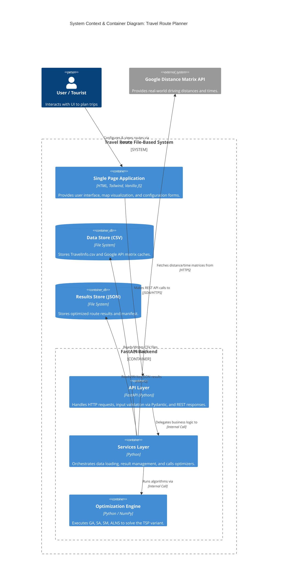
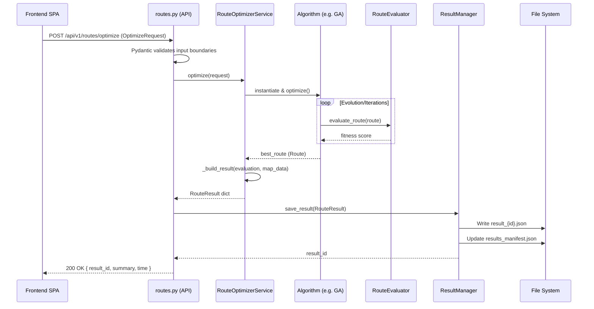
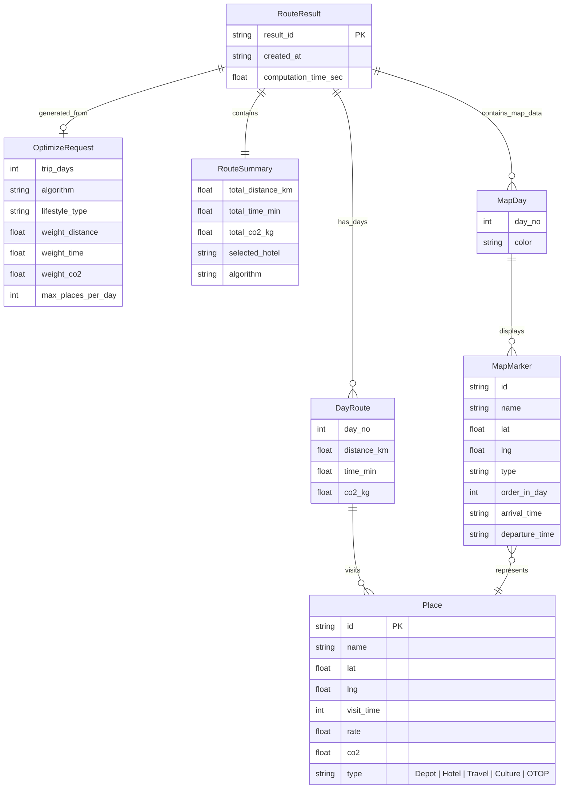

# System Architecture

## 1. Executive Summary & Tech Stack
The Travel Route File-Based System is an intelligent travel itinerary optimization platform designed for multi-day routes visiting tourist attractions in Nakhon Si Thammarat, Thailand. The system is designed as a standalone, file-based monolith with a clear separation between frontend visualization, API routing, orchestration, and optimization logic.

**Core Tech Stack:**
- **Frontend:** Vanilla JavaScript (ES2020+), HTML5, Tailwind CSS (via CDN), Leaflet (for Maps), Font Awesome.
- **Backend:** Python 3.11+, FastAPI, Uvicorn, Pandas (Data Manipulation), NumPy (Matrix Operations), Pydantic (Data Validation).
- **Storage:** File-based (CSV for input data and caches, JSON for optimization results). No external database is required.
- **External Dependencies:** Google Distance Matrix API (Optional, for real-world distance/time data).

## 2. Sub-Domain Mapping & Bounded Contexts
The application logic is naturally grouped into three main Sub-domains:

1. **Data Ingestion & Validation Context (`backend/app/services/data_loader.py` & `backend/app/api/files.py`)**
   - **Responsibility:** Loading, parsing, and validating `TravelInfo.csv` and Distance/Time matrices.
   - **Google API Integration:** Batches and fetches driving distance/time matrices and manages caching.
   - **Entities:** `Place`.

2. **Route Optimization Engine Context (`backend/app/optimizers/` & `backend/app/api/routes.py`)**
   - **Responsibility:** Executing meta-heuristic algorithms (GA, SA, SM, ALNS, and hybrids) to generate optimal multi-day routes based on user constraints.
   - **Entities:** `Route`, `OptimizeRequest`.

3. **Results Storage & Map Generation Context (`backend/app/services/result_manager.py` & `backend/app/api/results.py`, `map_api.py`)**
   - **Responsibility:** Persisting optimization outcomes to JSON files, maintaining the `results_manifest.json`, and exporting data as CSV/JSON.
   - **Visualization:** Translating route plans into `MapDay` and `MapMarker` structures ready for Leaflet consumption.
   - **Entities:** `RouteResult`, `RouteSummary`, `DayRoute`, `MapDay`, `MapMarker`.

## 3. High-Level System Overview Diagram



## 4. Project Tree Structure

```text
travel-route-file-system/
├── frontend/                     # [Frontend SPA]
│   ├── index.html                # UI Layout
│   └── js/app.js                 # API communication & Map rendering
├── backend/app/
│   ├── main.py                   # Application Entrypoint & State
│   ├── api/                      # [API Layer]
│   │   ├── files.py              # Data Ingestion
│   │   ├── routes.py             # Optimization Triggers
│   │   ├── results.py            # Result CRUD
│   │   └── map_api.py            # Map Data Endpoints
│   ├── services/                 # [Services Layer]
│   │   ├── data_loader.py        # CSV Parsing & Google API Integration
│   │   ├── route_optimizer.py    # Orchestration of algorithms
│   │   └── result_manager.py     # JSON/Manifest File Management
│   ├── optimizers/               # [Optimization Engine]
│   │   ├── base.py               # Route, RouteEvaluator abstract bases
│   │   ├── ga.py, sa.py, sm.py   # Core Algorithms
│   │   ├── alns.py               # ALNS Operators
│   │   └── ga_alns.py, sa_alns.py, sm_alns.py # Hybrid Algorithms
│   └── schemas/
│       └── models.py             # Pydantic Schemas (Input Validation)
├── data/                         # [Data Store Context]
│   ├── TravelInfo.csv            
│   └── inputs/                   # Matrix caches
└── storage/                      # [Results Store Context]
    ├── results/                  # Generated JSON results
    ├── manifests/                # results_manifest.json
    └── exports/                  # CSV/JSON exports
```

## 5. API Traces & Sequence Diagrams

**Flow: Route Optimization (`POST /api/v1/routes/optimize`)**



## 6. Data Models (ER Diagrams)



## 7. Architectural Assessment & Recommendations

**Strengths:**
- **Separation of Concerns:** The backend strictly separates API routing (`backend/app/api`), business logic orchestration (`services`), and pure algorithmic calculation (`optimizers`).
- **Input Validation:** High reliance on Pydantic ensures the system operates strictly on typed, validated data boundaries. The `services/` layer trusts input implicitly.
- **Portability:** Being entirely file-based avoids the overhead of managing a relational database (e.g., PostgreSQL). Ideal for local execution, desktop deployments, or prototype phases.

**Areas for Improvement / Technical Debt:**
1. **Concurrency and Scaling:**
   - **File-based Concurrency:** The `ResultManager` modifies the `results_manifest.json` via basic File I/O. If multiple optimization requests finish concurrently, there's a risk of a race condition leading to corrupted JSON or overwritten manifest entries.
   - *Recommendation:* If deployed as a web service, introduce a lightweight lock (e.g., `filelock` library) or transition the manifest/results storage to a proper database (SQLite is a logical step up).
2. **Global State (`app_state`):**
   - Singletons like `DataLoader` and `ResultManager` are stored in an `app_state` dict during `startup`. This limits the ability to scale to multi-worker environments (e.g., multiple Gunicorn workers) because each worker will maintain its own data state in memory.
   - *Recommendation:* Offload shared state (like parsed matrices) to an in-memory cache (Redis/Memcached) or ensure worker synchronization if deployed beyond a single process.
3. **Frontend Modularity:**
   - The frontend uses a single `app.js` (700+ lines) handling DOM manipulation, Leaflet lifecycle, and API fetching.
   - *Recommendation:* While completely functional, separating API wrappers, Map Logic, and DOM Event listeners into distinct JS modules would enhance long-term maintainability.
