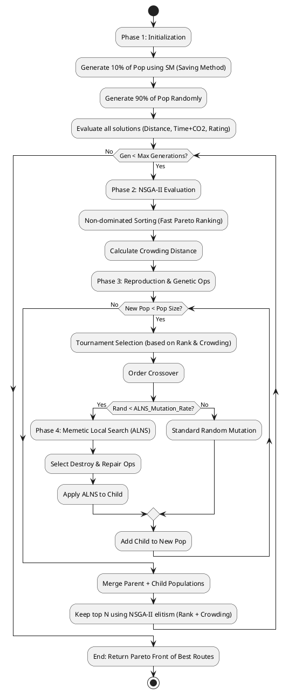

# Algorithm Improvement Plan

## Problem Statement
How might we develop a dominant, hybrid routing algorithm that consistently outperforms current individual methods across multiple conflicting objectives (Distance, Time, CO2, Place Rating), ensuring high-quality, feasible travel itineraries without unacceptable computation delays?

## Current Landscape & Algorithm Benefits

Our benchmark results highlight the strengths and weaknesses of our existing routing algorithms:

*   **SM (Saving Method):**
    *   *Benefits:* Extremely fast (instantaneous), deterministic, always produces feasible results. Good at minimizing distance relative to a hub.
    *   *Weaknesses:* Greedy nature means it often gets stuck in local optima; poor at global exploration, leading to sub-optimal CO2 and Time metrics on complex multi-day routes.
*   **GA (Genetic Algorithm):**
    *   *Benefits:* Excellent global exploration. Highly effective at finding paths with low CO2 emissions and optimizing travel time. Consistently dominates on fitness for smaller/medium datasets.
    *   *Weaknesses:* Slower convergence; struggles to maintain strict feasibility constraints on very large, highly constrained datasets without careful tuning.
*   **SA (Simulated Annealing):**
    *   *Benefits:* Good balance of exploration and exploitation. Handles complex constraint landscapes fairly well.
    *   *Weaknesses:* High computation time due to cooling schedules. Can be highly sensitive to initial temperature parameters.
*   **ALNS (Adaptive Large Neighborhood Search):**
    *   *Benefits:* Exceptional at repairing broken constraints and escaping local optima through aggressive destroy/repair operators. Often produces routes with the highest average place ratings.
    *   *Weaknesses:* Heavy reliance on the initial solution quality. Pure ALNS can be computationally expensive and chaotic if unguided.
*   **Hybrid Models (SM+ALNS, GA+ALNS, SA+ALNS):**
    *   *Benefits:* Combine fast initialization (SM) or global search (GA/SA) with the local refinement of ALNS. GA+ALNS currently shows the strongest overall multi-objective performance.
    *   *Weaknesses:* Compounding computation times (especially SA+ALNS, which frequently times out or fails constraints on large datasets).

## Recommended Direction: Mixed SM-GA-ALNS with NSGA-II Backbone

To achieve strict dominance across distributed objectives, we must move away from simple sequential hybridization (e.g., Run GA -> Run ALNS) and toward a deeply integrated approach. I recommend building a **Mixed SM-GA-ALNS with an NSGA-II Backbone** (also known as a Multi-Objective Memetic Algorithm).

This approach embeds ALNS directly *inside* the evolutionary loop of the Genetic Algorithm, using a Pareto-based evaluation (NSGA-II) rather than a simple weighted-sum fitness score, and seeds the initial population using the Saving Method (SM).

**Why this mixed strategy works:**
1.  **SM Initialization (The 'SM' part):** Seed 10-20% of the initial GA population with SM (Saving Method) routes. This guarantees immediate feasibility, bounds the initial distance search space, and drastically accelerates convergence compared to purely random GA initialization.
2.  **Pareto Dominance (The 'NSGA-II' backbone):** Instead of collapsing Distance, Time, and CO2 into a single score (which hides trade-offs), the GA maintains a population of diverse, non-dominated solutions. This guarantees we find routes that genuinely dominate on specific individual objectives, allowing us to offer a "Pareto Front" of options.
3.  **Memetic Local Search (The 'ALNS' injection):** Instead of pure random mutation inside the GA, we apply lightweight ALNS operators (e.g., Shaw Removal, Regret Insertion) to the offspring. ALNS acts as a "smart mutation" to locally optimize specific objectives (e.g., targeting high-CO2 places for removal) before returning the offspring to the population pool.

## Key Assumptions to Validate
- [ ] **Computation Time:** Embedding ALNS inside a GA loop will explode computation time unless ALNS iterations are kept extremely low (e.g., 2-3 iterations per offspring). We assume a fast, lightweight ALNS operator is sufficient for local refinement.
- [ ] **Pareto Sorting Overhead:** Calculating non-dominated sorting (NSGA-II) at every generation is computationally heavier than scalar fitness. We assume this overhead is justified by the resulting objective dominance.
- [ ] **Constraint Handling:** Multi-objective algorithms often struggle with strict feasibility bounds (e.g., exactly 1 OTOP, 3-7 places per day). We assume penalty functions applied to the Pareto rank will adequately steer the population toward feasible space.

## MVP Scope (Phase 1 Implementation)

The MVP will implement a simplified MOMA to prove the concept beats `GA+ALNS` on the benchmark:

1.  **Initialization:** Generate a population of 50. Seed 5 solutions using `SMOptimizer`. Fill the rest randomly.
2.  **Evaluation:** Replace the scalar `fitness()` function with a Pareto dominance sorter focusing on 3 axes: `Minimize(Distance)`, `Minimize(Time + CO2)`, `Maximize(Rating)`.
3.  **Smart Mutation (Micro-ALNS):** Replace standard random mutation with a Micro-ALNS step. Apply 1 random destroy operator and 1 greedy repair operator to 20% of the offspring.
4.  **Benchmarking:** Run against `Small3`, `Large3`, and `Real2` cases.

**What is OUT of scope for MVP:**
- Full NSGA-II crowding distance calculations (use simple Pareto ranking with random tie-breaking for speed).
- Adaptive weight updates for ALNS operators (use static random choice).
- Real-time frontend visualization of the Pareto front.

## Not Doing (and Why)

- **Deep Learning / Reinforcement Learning:** Training a neural network to predict routes requires massive datasets we don't have, and inference would likely violate our sub-5-second computation goal.
- **Pure SA enhancements:** Simulated Annealing has consistently shown poor scaling on large datasets in our benchmarks. Continuing to tune SA is a sunk cost.
- **Lingo / Exact Solvers (MILP):** While guaranteed to find the *absolute* optimal, they will inevitably time out on the 44-place `Real` test cases due to the NP-Hard nature of the Vehicle Routing Problem with Time Windows (VRPTW).

## Open Questions
- What is the absolute maximum acceptable computation time for the user? If they will wait 10 seconds for a perfect route, we can lean heavier into ALNS refinement. If it must be under 3 seconds, we must optimize the Pareto sorting heavily.
- Should we expose the Pareto front to the user on the frontend? (e.g., showing 3 route options: "Fastest", "Eco-Friendly", "Highest Rated") rather than just returning one "Best" route?

## Algorithm Design & Pseudocode

### Flowchart


### Pseudocode
```text
// 1. Initialization (Phase 1: Hybrid Seed)
Create empty population P
P_SM = Generate routes using SM_Optimize() (10% of Pop size)
P_Random = GenerateRandomPopulation(90% of Pop size)
P = P_SM ∪ P_Random
Evaluate multiple objectives for each route in P (F1: Dist, F2: Time+CO2, F3: -Rating)

Generation = 1

// 2. Evolution Loop (Phase 2: NSGA-II Backbone)
WHILE Generation <= Max_Generations DO:
    
    Create new_population P_child
    
    // a. Reproduction
    WHILE size(P_child) < Pop_Size DO:
        // Selection based on Pareto Rank and Crowding Distance
        Select parents P1, P2 using Binary Tournament
        
        // Crossover
        Child = Order_Crossover(P1, P2)
        
        // b. Memetic Local Search (Phase 3: ALNS Injection)
        IF Random() < ALNS_Mutation_Rate THEN
            destroy_op = Select Random Destroy (Random, Worst, Shaw)
            repair_op = Select Random Repair (Greedy, Random, Regret)
            Child = repair_op(destroy_op(Child))
        ELSE IF Random() < Standard_Mutation_Rate THEN
            Child = Mutate_Swap_or_Reverse(Child)
        END IF
        
        Evaluate multiple objectives for Child
        Add Child to P_child
    END WHILE
    
    // c. Environmental Selection (NSGA-II Elitism)
    P_combined = P ∪ P_child
    Assign Pareto Ranks using Non-dominated Sorting on P_combined
    Calculate Crowding Distance for each rank
    
    // Keep top Pop_Size individuals based on Rank, then Crowding Distance
    P = SelectTopN(P_combined, Pop_Size)
    
    Generation = Generation + 1
END WHILE

// 3. Return Best Solutions
RETURN Pareto_Front(P) // List of non-dominated routes
```